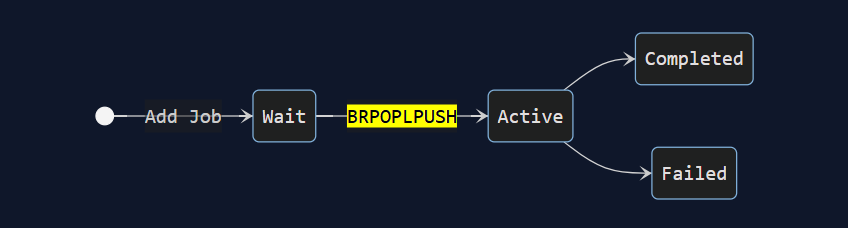
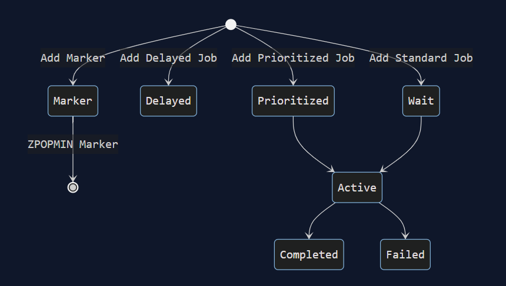

One of the things I tried to do was figure out how to change the worker marker for bullmq v5. So I tried to get a better understanding of how it works/what changed.

They changed it essentially from it being one list: Active where it’s like a linked list queue which means it should be simple. Jobs go in and jobs go out. LILO/LIFO. But the issue came with the marker because they wanted to mark some of the jobs as repeating or higher priority which means they have to navigate through this list which then meant it was really inefficient.

Which is why they changed it so there’s essentially multiple lists to go into rather than one big list that is cumbersome/inefficient to navigate with.

The problem comes in to changing it because I can’t find any documentation explaining how you would change or what specifically with the code that needs to be changed or the original way markers were. Most of what I find is just documentation explaining the reasoning/higher level idea of what they changed but nothing specific. I looked at the api/documentation for queue and worker but none of them had any information on markers.

So I looked to their github repo to try to find any potential documentation. https://github.com/taskforcesh/bullmq/pull/2730#issuecomment-2314308013. There were talks about creating documentation but I can’t find that documentation which leads me to believe that they will make that documentation in the v6 release when they remove the old marker logic.

I’m also not really sure if the existing code needs to be changed since my understanding is that this only affects the queue if there is any markers being used since they’re being changed which means it’s not really the queue/worker itself but the marker inside the queue/worker being changed.

Another thing I started doing was creating npm script documentation for the scripts in starchart. I made the PR here. https://github.com/DevelopingSpace/starchart/pull/819

I went through with figuring out on a surface level what the script does. I just don’t know and don’t know weather to explain in a more detailly way. Like there was a predev script that I didn’t know what it did since it just ran a different npm script but apparently it’s like a script before it builds for development or something like that. But there’s also a bit of not knowing how it should be formatted. Like some scripts reference other scripts so it could be linked but it might not explain in a wider context why it’s running them. Kind of hard.
