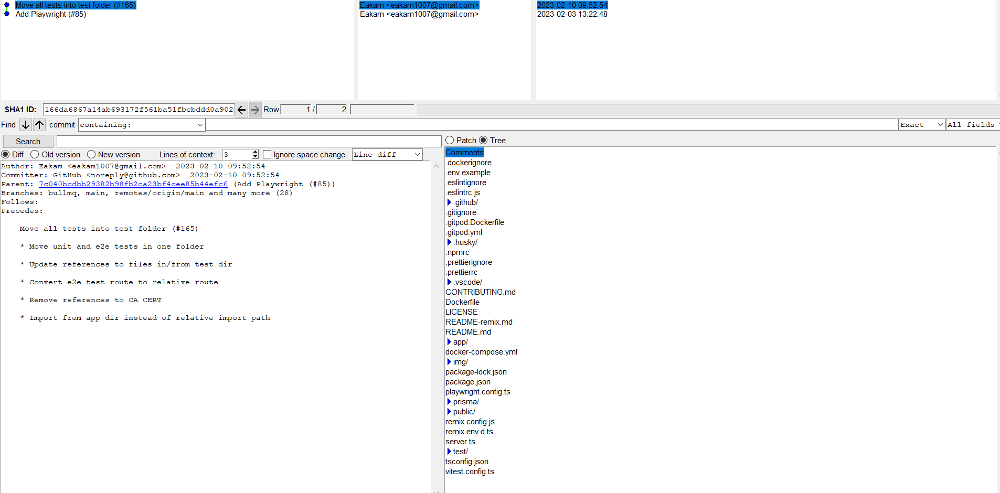

So I'm setting up starchart:

First issue ish is the docker-compose.yml: C: the attribute version is obsolete, it will be ignored, please remove it to avoid potential confusion"

As expected, it has a few vulnerabilities cause it's using node 18 but it's a lot less than I was expecting. It's 13 high, 8 moderate, and 7 low vulnerabilities.

Besides that it more or less still works.

With chatcraft, it worked with running locally without a hitch.

