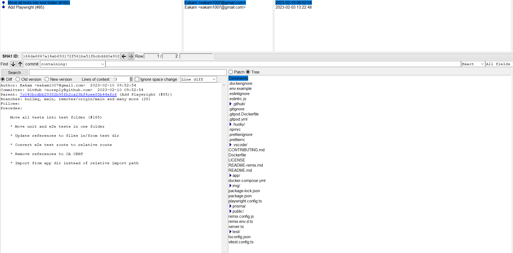

I didn’t have time to do a lot of time to do anything that big. I just continued with trying to land the Pr in hurl(https://github.com/Orange-OpenSource/hurl/pull/3714) and do some reviews for PRs in starchart.

Going into that. I discovered gitk which is like a visual browser for commits which I think is pretty cool. I used it while reviewing this PR (https://github.com/DevelopingSpace/starchart/pull/835) which removed the e2e folder and I wanted to make sure nothing was missed, like maybe it was used while being hosted or in a way that I didn’t know about, like the predev npm command. So I used it to see when it was referenced and I got a view like this

This just shows why the e2e folder was removed/moved and that removing it the gitignore and dockerignore wouldn’t cause any issues. Like I was pretty sure it wouldn’t cause any issues since it wasn’t refered to anywhere else but I wanted to make sure and the commit/commit history to know why it was removed/where it was(https://github.com/DevelopingSpace/starchart/commit/166da6867a14ab693172f561ba51fbcbddd0a902). It also showed me that cypress was used and was replaced by playwright. I went to the PR that was on github and then to the issue that it was referencing(https://github.com/DevelopingSpace/starchart/issues/25) and the issue was that the initial setup uses Remix Blue Stacks and it needed to be replaced by playwright. (I don’t entirely understand why; I know it was giving typecheck issues but I don’t know why/I don’t have the entire context for why) which is kind of fun.

I looked over some of the other PRs but they didn’t really require gitk. (https://github.com/DevelopingSpace/starchart/pull/833) (https://github.com/DevelopingSpace/starchart/pull/840) and just needed to be looked up online for how the migration would work.

So I didn’t have much time to really write much so I’m probably gonna be doing a bit over the reading week.
