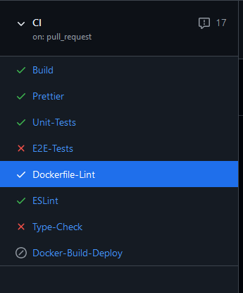
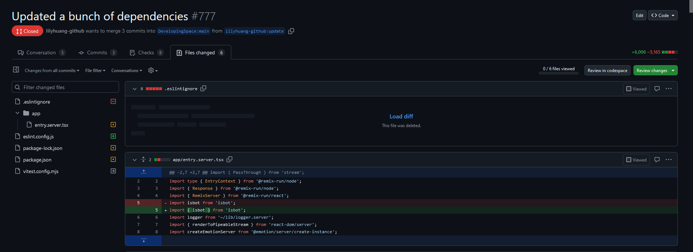
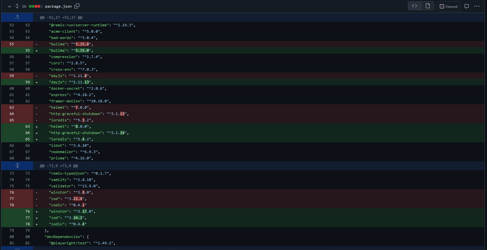
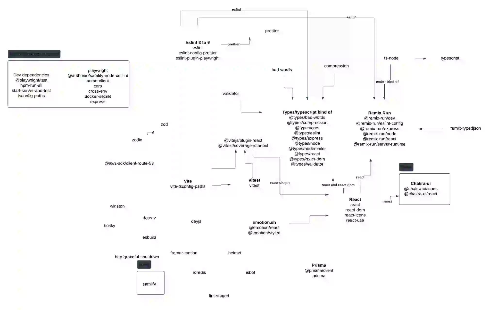

So what I worked on was trying to update the packages in Starchart. A lot of the packages are linked together and while researching how to update a node project, there's kind of two ways to go about it. Doing a huge jump or incrementally. The argument for the huge jump was that some of the changes you make from a small jump might break when you do another small jump. Like if you go from node 18 to 20 and change stuff around, the stuff that works for node 20 might not work for node 22 so then you might as well go all the way. But the argument against is that it's a lot to change all at once. SO I went with trying to update the node projects.

I tried to update the projects that wouldn't conflict with any other project but there were some issues that came from it. So I tried to do that but it came into some issues. I tested by running it locally but it broke when ran through the unit tests.

So after that issues I tried again and went with updating a lot fewer packages that shouldn’t conflict with anything.
So after that issues I tried again and went with updating a lot fewer packages that shouldn’t conflict with anything.

I also made a mind map to try to visualize some of the associations between the packages. From the mind map it kind of visualizes the issues I had with trying to update things since a lot of the packages are related to one another in one way or another, so then it kind of felt like I had to update a different package if I updated something and then it leads all the way down to more packages.
