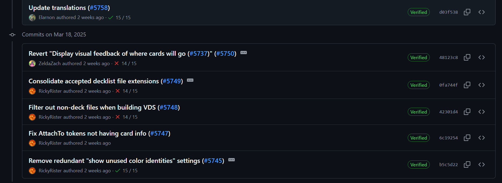

For the main focus of this week was using the automated testing to test the accessibility of starchart.
From the automated accessibility testing using Axe-Core I created three different issues:

1. https://github.com/DevelopingSpace/starchart/issues/875
2. https://github.com/DevelopingSpace/starchart/issues/876
3. https://github.com/DevelopingSpace/starchart/issues/877

The first issue is that there are menu buttons that are just icons (don’t contain text) and also don’t have an aria label so there isn’t anything to explicity tell a screen reader on how to read the button. So I created a PR to try to fix this issue by adding an aria-label.
https://github.com/DevelopingSpace/starchart/pull/879

The second issue was an issue of the levels of the header skipping a level. The fix was fairly simple and one of them was fixing a component’s header level
https://github.com/DevelopingSpace/starchart/pull/880/files#diff-19b8f27a2fd26d4cb057f157f4d1a9629a3f7ea57d586c007321a737802919b9

For the third issue it was more complicated to fix. The issue is that lists shouldn’t contain non list elements; so if you have an ol or an ul element then it should have li elements in it and not things div elements. The issue I ran into was trying to do this with chakra since my inkling was putting the chakra components into a chakra list component but that was causing an error and I’m still working on that.

A different issue I was working on was an issue with the CICD on Cockatrice.

You can see that that CICD randomly doesn’t work/gives an error, and the error is with the macOS 13 and macOS 15 DMG job, the CICD is essentially creating an image of the software so it can be ran on macOS 13, macOS 15, and all the other operating systems set in the CICD. So I investigated it a bit and ran into this issue https://github.com/actions/runner-images/issues/7522. From what I’ve read, it’s a known issue that’s being figured out on github’s end. It might be specifically on how the runner-images/github actions is programmed but it might also just be on how resources for github actions is handled in githubs end. There is a work around for this issue where you have it re-run the action until it works but it’s a work around when it’s an issue on github’s end so I kind of put my investigation for this into rest since this isn’t an issue specific to cockatrice and the way they do releases means they don’t need the CICD to work every single time.
