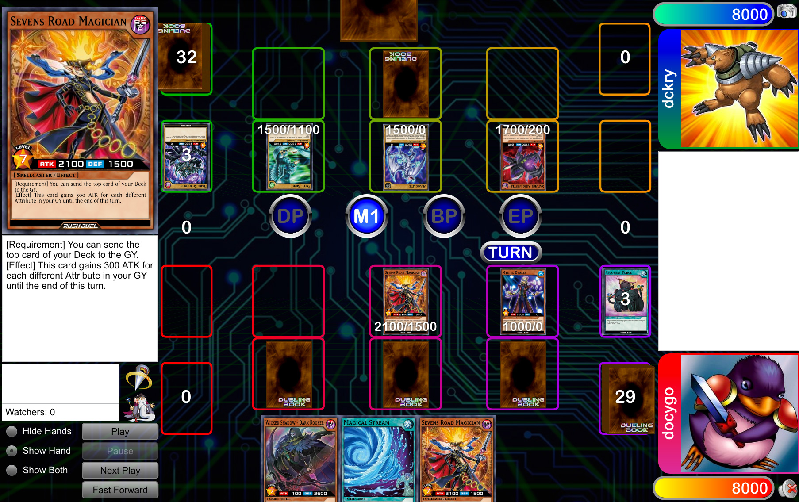

I did a bit of work on Cockatrice over the reading week. Which gave me a bit of insight into how the project works and project overall.

I had 3 PRs: https://github.com/Cockatrice/Cockatrice/pull/5670
https://github.com/Cockatrice/Cockatrice/pull/5663
https://github.com/Cockatrice/Cockatrice/pull/5657
They’re all fairly minor.

1. The first one, it added an link for when you go into the settings to change the language to show that you could potentially help translate the project.

2. The second one was putting a hint on what the project version you’re updating to is since when you’re updating to a new version it doesn’t tell you what your version is updating to.

3. Third one was making it focus on a screen when you try to exit it.

The current one I’m working on is this: https://github.com/Cockatrice/Cockatrice/issues/3631
The issue is essentially that when you’re searching for a card it sometimes doesn’t highlight the card which makes it difficult for when you’re pasting in the card name and want to quickly add the card to your deck by pressing enter since it won’t be highlighted so you have to manually click it.
I think the issue is just an issue with the order of how things are checked so I’m gonna try to do that.

Onto the project overall, they have a certain way of making translations. The CI/CD automatically makes TS files from the pages that there are and through the TS files are how things get translated. So there’d be a TS file for english and files for other languages.
The other interesting thing I’ve learned is the difference in how projects are. Like with this there’s just a lot of things to do. Like currently they’re trying to decouple/not have the Magic the Gathering component so deeply entrenched and have it as a general card game app with a Magic the Gathering plugin, and also a web client, and also there’s a bunch of issues that haven’t been done yet that are really old. Like the oldest issue I had a PR for was from 2015, which is like 10 years ago.
But it’s also a project that I feel like regular people use, like not just programming/tech people use and relatively functional in it’s current state. It kind of reminds me of the “Dueling Network”/Dueling Book which is an online Yugioh playing client which is kind of ugly/dated but works and people use it.

This type of UI is kind of dated but a sizeable amount of people use it because there aren’t a lot of alternatives that do what they do or are currently being maintained.

Like this with, it’s kind of very utilitarian in which it’s not nice looking but it has a lot of functionality.
